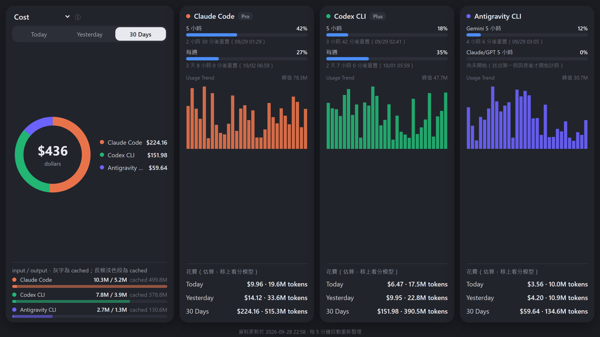

# Splitrail Dashboard

彙總 Claude Code／Codex CLI／Antigravity CLI 三家 AI coding 工具的用量，產出仿
[OpenUsage](https://www.openusage.ai/) 風格的視覺化網頁：總花費甜甜圈（可切換 Cost／Cost per
MTok／Tokens）、每家的訂閱額度條（5 小時／每週，含重置倒數與 pace 預估）、近 30 天用量趨勢、
分模型花費明細。



**訂閱額度直接查官方用量 API**，不需要另外開程式：Claude 用 Claude Code CLI 的
`~/.claude/.credentials.json`，token 過期時由本儀表板自動換新並寫回（寫入前備份到同目錄的
`.credentials.json.splitrail-bak`；若顯示「登入已失效」請執行 `claude auth login`）；Codex 用
`~/.codex/auth.json`（token 失效時卡片會提示，在終端機跑一次 codex 即可刷新）；Antigravity 只在
App 或 `agy` 執行中才抓得到。

> ⚠ **不要同時執行其他也會換 Claude token 的工具**（例如 Pane、OpenUsage）：refresh token 用過即作廢，
> 兩個程式同時換新會互相作廢，Claude Code CLI 會被迫重新登入。

費用是本機 token 紀錄乘上官方 API 單價的**估算值**，不是官方帳單金額，只拿來看相對趨勢：
- **Claude Code**：由 [splitrail](https://github.com/Piebald-AI/splitrail) 計算。
- **Codex CLI**：自行讀 `~/.codex/sessions`，含 fast（priority）加價、fork／subagent 子 session 去重、
  超過 272K input 的長 context 單價。splitrail 這三項都沒處理；子 session 重播改用跨檔案累計值去重。
- **Antigravity**：自行讀 `~/.gemini/antigravity*/conversations`（CLI、IDE、App 都算）。splitrail 3.10.1
  把 token 欄位解讀錯誤且只讀 CLI，數字不可用。
- 單價寫在 `splitrail-dashboard.py` 的 `CODEX_PRICES`／`GEMINI_PRICES`，依官方價目頁核對（2026-09-28）；
  `codex-auto-review` 紀錄裡沒有實際模型，依推定以 gpt-5.5 計價。

系統需求、逐項測試步驟、疑難排解與安全須知見 [docs/環境與測試說明.md](docs/環境與測試說明.md)。

## 安裝（Windows）

1. 這個資料夾需要 [splitrail](https://github.com/Piebald-AI/splitrail) 的執行檔。用
   [GitHub CLI](https://cli.github.com/) 下載並解壓縮到**跟這個 README 同一層資料夾**：
   ```powershell
   gh release download --repo Piebald-AI/splitrail --pattern "*x86_64-pc-windows-msvc.zip"
   # 解壓縮出來的 splitrail.exe 放到這個資料夾（跟 splitrail-dashboard.py 同層）
   ```
   或直接去 [splitrail Releases](https://github.com/Piebald-AI/splitrail/releases) 手動下載對應平台的壓縮檔。
2. 確認電腦已安裝 Python 3（含 `python` 指令可在任何路徑直接呼叫）。

## 使用

所有功能都在 `splitrail-dashboard.bat` 一支檔案裡，雙擊或加參數執行：

| 指令 | 效果 |
| :-- | :-- |
| `splitrail-dashboard.bat` | 產生 `splitrail-dashboard.html` 並自動用瀏覽器打開 |
| `splitrail-dashboard.bat --text` | 只印文字表格（各工具的累計/近7天/近30天/今日費用與 token） |
| `splitrail-dashboard.bat --no-open` | 只產生 HTML，不自動開瀏覽器 |
| `splitrail-dashboard.bat --loop` | 背景常駐，每 5 分鐘靜默更新一次網頁（開著的網頁也會每 5 分鐘自動重新載入） |

`.bat` 只是免打 `python` 的捷徑，主程式是 `splitrail-dashboard.py`（只用標準函式庫）。

**開機自動更新（選用）**：沒有系統管理員權限、不能用工作排程器時，在 Windows 個人啟動資料夾
（`Win+R` 輸入 `shell:startup`）放一個內容為
`start /min "" "<這個資料夾路徑>\splitrail-dashboard.bat" --loop` 的 `.bat`。

## 授權

[MIT License](LICENSE)。splitrail 為 [Piebald-AI/splitrail](https://github.com/Piebald-AI/splitrail) 的獨立專案，
需另外下載，不包含在本 repo 內。Antigravity／Codex 的讀取方式參考 [OpenUsage](https://github.com/robinebers/openusage)（MIT）。
